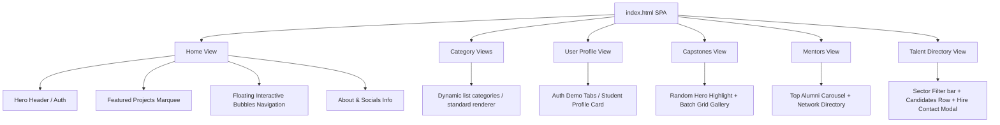

# Implementation Plan: oU1TS Portal SPA Conversion & Feature Expansion

This plan outlines the refactoring of the "oU1TS Portal" codebase from a multi-page website into a high-performance, visually rich Single Page Application (SPA) inside `index.html`. It also introduces four new dynamic sections (User Profile, Capstone Projects, Industry Mentors, and "Hire Us" Talent Directory) with premium design layouts, micro-animations, and full responsive support.

---

## Proposed Architectural Changes

### 1. SPA Navigation & Floating Bubbles Layout
- **Consolidation**: Consolidate all 8 category pages (`materials`, `tools`, `guidance`, `community`, `courses`, `portfolios`, `official`, `inspirations`) and 4 new sections (`profile`, `capstones`, `mentors`, `talent`) into a single `index.html` file using SPA views.
  - The external link `contributions.html` (Contributors) will remain as a separate external file.
- **Dynamic View Routing**: Implement a custom hash-based SPA router in `js/spa-controller.js` to manage active states, transitions, and loading states.
- **Playful Floating Navigation**:
  - The landing page grid will be replaced by a modern, high-fidelity canvas populated with **floating interactive bubbles**.
  - A collision-detection algorithm in JavaScript will position these nodes randomly upon canvas load and window resize, avoiding overlapping.
  - Micro-animations (CSS float keyframes, glow expansions on hover, and active tap states) will make the portal feel extremely premium.
  - Custom gradient styling and matching colored glows will be assigned to each button node:
    - **Materials**: Purple gradient (`#f3e5f5` to `#e1bee7`, glow `#7b1fa2`)
    - **Tools**: Green gradient (`#e8f5e9` to `#c8e6c9`, glow `#388e3c`)
    - **Guidance**: Light blue gradient (`#e1f5fe` to `#b3e5fc`, glow `#0288d1`)
    - **Community**: Pink gradient (`#fce4ec` to `#f8bbd9`, glow `#c2185b`)
    - **Course Repos**: Cyan gradient (`#e0f7fa` to `#b2ebf2`, glow `#00838f`)
    - **Portfolios**: Orange gradient (`#fff3e0` to `#ffe0b2`, glow `#f57c00`)
    - **Official UITS**: Blue gradient (`#e3f2fd` to `#bbdefb`, glow `#1976d2`)
    - **Inspirations**: Indigo gradient (`#e8eaf6` to `#c5cae9`, glow `#3f51b5`)
    - **User Profile**: Purple-violet gradient (`#ede7f6` to `#d1c4e9`, glow `#5e35b1`)
    - **Capstone Projects**: Red-pink gradient (`#ffebee` to `#ffcdd2`, glow `#e53935`)
    - **Industry Mentors**: Teal gradient (`#e0f2f1` to `#b2dfdb`, glow `#00695c`)
    - **Talent Directory**: Gold-yellow gradient (`#fffde7` to `#fff9c4`, glow `#fbc02d`)
    - **Contributors (External)**: Emerald gradient (`#e8f5e9` to `#c8e6c9`, glow `#4caf50`)

### 2. User Profile Section
- **Unified Authentication State**: Check for active Supabase user session. If Supabase is unavailable (or errors out), fall back to a local storage database that mimics registration and login.
- **Unauthenticated Tabbed Form**: Present a stunning connection panel with "Login" and "Register" tabs, featuring glassmorphism and validation states.
- **Authenticated Dashboard**:
  - Profile card showing: Name/Student ID, Email, and Join Date.
  - Metrics tracking: Starred Resources count and Contribution count.
  - Interactive "My Starred Resources" directory: Automatically list resources starred by the logged-in user, allowing one-click deletion or navigation.

### 3. Capstone Projects Section
- **Data Source**: Create `json/capstones.json` representing UITS student projects.
- **Highlights Panel**: The top half features a large, hero-style "Project Showcase" which randomly selects and highlights a project on load.
- **Grouped Gallery**: The bottom half lists all capstone entries sorted and cataloged by student batches (e.g. Batch 51, Batch 52) with expand/collapse capabilities.

### 4. Industry Mentors Section
- **Data Source**: Create `json/mentors.json` containing profile records of active alumni.
- **Featured Seniors Row**: The top half displays a horizontally scrollable carousel of senior alumni sorted by star/rating rankings.
- **Alumni Directory**: The bottom half provides a directory of network contacts showing details on company role, batch, and an direct action button to request mentorship.

### 5. "Hire Us" Talent Directory
- **Data Source**: Create `json/talent.json` listing skilled student candidates.
- **Dynamic Skills Filter Bar**: Provide a filter bar at the top for tech sectors (e.g. Web Dev, App Dev, UI/UX, AI/ML) and specific skills (e.g. React, Python). Clicking filters the cards list instantly.
- **Interviewer Contact Modal**: Each student card row will feature a prominent "Hire" button. Clicking this triggers a smooth overlay card showing preferred social media contacts (LinkedIn, GitHub, Telegram, Email) to immediately start conversations.

---

## Component Layout Structure (`index.html`)

---

## File Changes & Creation Plan

### Core Setup & Configuration

#### [NEW] [capstones.json](Documents/GitHub/[oU1TS]/portal/json/capstones.json)
- Store structured capstone project entries with attributes: `id`, `title`, `description`, `batch`, `semester`, `team`, `visitUrl`, `tags`, `image`.

#### [NEW] [mentors.json](Documents/GitHub/[oU1TS]/portal/json/mentors.json)
- Store alumni records: `id`, `name`, `title`, `company`, `experience`, `batch`, `stars`, `email`, `socials` (linkedin, github, telegram), `skills`.

#### [NEW] [talent.json](Documents/GitHub/[oU1TS]/portal/json/talent.json)
- Store candidate profiles: `id`, `name`, `role`, `sector`, `skills`, `bio`, `socials` (linkedin, github, telegram, email).

#### [NEW] [spa-controller.js](Documents/GitHub/[oU1TS]/portal/js/spa-controller.js)
- Handle URL hash changes (`window.location.hash`).
- Hide and show respective view elements.
- Maintain view transition animations.
- Manage data fetching, caching, and rendering triggers for all category lists and new sections.
- Initialize bubbles layout collision-detection and random placement algorithm.

#### [MODIFY] [index.html](Documents/GitHub/[oU1TS]/portal/index.html)
- Define section container blocks (`#homeView`, `#materialsView`, `#profileView`, etc.) with CSS state triggers.
- Embed HTML templates for Profile tabs/card, Capstone spotlight, Mentor slider, Talent rows, and Hire modal.
- Include script tags for the new `spa-controller.js` and JSON loaders.

#### [MODIFY] [style.css](Documents/GitHub/[oU1TS]/portal/style.css)
- Implement floating bubble keyframe animations, glow states, and container canvas boundaries.
- Add CSS variables and classes for dark mode/glassmorphism transitions, Profile stats dashboard, highlight banner layout, mentor scrollbars, and popup modals.

#### [MODIFY] [js/data-renderer.js](Documents/GitHub/[oU1TS]/portal/js/data-renderer.js)
- Adapt rendering functions to target active SPA view elements.
- Expose methods to trigger rendering on route change.

#### [MODIFY] [js/stars.js](Documents/GitHub/[oU1TS]/portal/js/stars.js)
- Adapt to SPA context by initializing star data for the active route dynamically.
- Consolidate standard lists and dropdown list star behaviors.

#### [MODIFY] [js/auth.js](Documents/GitHub/[oU1TS]/portal/js/auth.js)
- Integrate auth flow listeners with the Profile view updates.
- Create local storage authentication mock database to enable complete login/register flows when Supabase is disconnected.

### Obsolete Files Removal

To avoid duplicate code, the original static category HTML pages will be deprecated:
- **[DELETE]** `materials.html`
- **[DELETE]** `tools.html`
- **[DELETE]** `guidance.html`
- **[DELETE]** `community.html`
- **[DELETE]** `courses.html`
- **[DELETE]** `portfolios.html`
- **[DELETE]** `official.html`
- **[DELETE]** `inspirations.html`

---

## Verification Plan

### Automated Tests
- Perform a manual build / code linting verify using PowerShell tools.

### Manual Verification
1. **Routing Verification**: Change hash routes manually via URL (e.g. `#profile`, `#capstones`) and verify correct view is transitioned with back button returning to `#`.
2. **Floating Buttons**: Verify bubbles randomize position cleanly without overlaps, resize responsive viewport, and float with micro-animations.
3. **User Profile**:
   - Register a mock student and verify successful redirect to dashboard showing details.
   - Click "Star" on any resource across categories, go to `#profile`, and verify it appears in the "My Starred Resources" panel.
4. **Capstone highlight**: Refresh the page or click Capstones button multiple times to verify the "Central Highlight" project changes randomly.
5. **Talent Filtering**: Select tags in the Talent Directory filter bar, verify candidate list filters down instantly. Click "Hire" and check that the social contact modal slides up.
