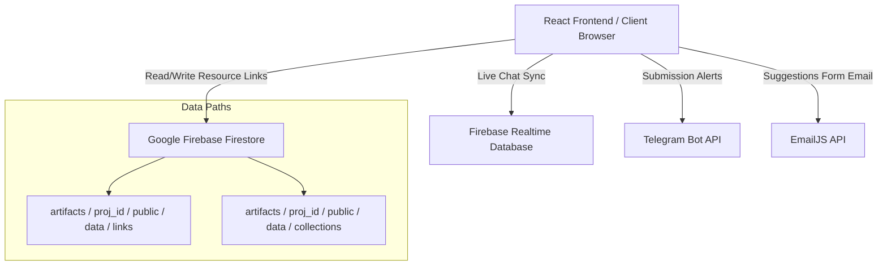
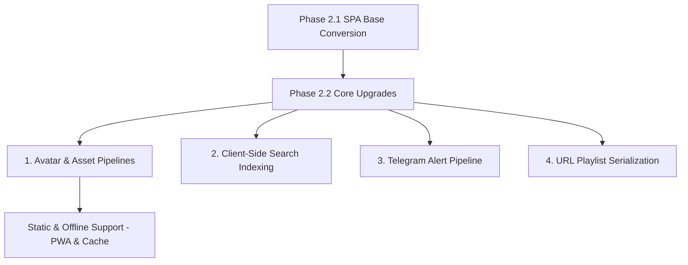

# Phase 2 Redesign & Feature Expansion Plan: oU1TS Portal

This plan deconstructs the architecture, tech stack, and data model of the reference site [UIU LinkSphere](https://uiulinks.vercel.app/) and defines a structured roadmap to integrate similar premium upgrades into the **oU1TS Portal** without violating its static hosting (GitHub Pages) constraints.

---

## 1. Reference Site Tech Stack & Architecture Summary

A deep binary and code deconstruction of the compiled bundles for [UIU LinkSphere](https://uiulinks.vercel.app/) (formerly `webpackChunkuiu_linksphere`) reveals the following architecture:

### Tech Stack Blueprint
* **Core Library & Framework:** **React (v18.3.1)** initialized via **Create React App (Webpack)**. This is confirmed by:
  * Webpack chunk definitions (`self.webpackChunkuiu_linksphere`) and folder patterns (`/static/js/[name].[hash].chunk.js`).
  * Environment configuration variables matching the `REACT_APP_` prefix.
* **Routing & State Management:** **React Router (v6+)** handles view transitions, scroll restoration, and navigation state using client-side routing hooks (`useFetcher`, `useSubmit`, `useViewTransitionState`, `useScrollRestoration`).
* **Styling & Layout:** **Tailwind CSS** is utilized for responsive grid layouts and modern card structures.
* **Hosting & Deployment:** Hosted on **Vercel** with full integration of Vercel Web Analytics and Vercel Speed Insights (`https://va.vercel-scripts.com/v1/script.debug.js`).

### Core Third-Party Service Dependencies
* **AI Engine:** **Google Gemini API** (using client-side API keys `REACT_APP_GEMINI_API_KEY`) to power the natural language query search assistant ("LinkLagbe AI").
* **Email Broker:** **EmailJS** (`https://api.emailjs.com/api/v1.0/email/send`) is used to dispatch resource submissions and suggestions directly from the browser to admin emails without a custom backend.
* **Avatar Engine:** **DiceBear API** (`https://api.dicebear.com/9.x/avataaars/svg`) dynamically generates SVG avatars for user cards using unique text seeds.

---

## 2. Data Storage & Retrieval Mechanism Analysis

UIU LinkSphere utilizes a serverless hybrid data architecture rather than relying on static JSON files:

### Key Architectural Findings

#### A. Cloud Database Layer (Firestore)
* All notes, class routines, portals, and resource cards are **not static**. They are queried dynamically from **Google Cloud Firestore** (modular SDK `@firebase/firestore` v9+).
* **Document Schema Strategy:** Firestore paths are structured hierarchically:
  * **Link Documents:** `artifacts / [projectId] / public / data / links / [linkId]`
  * **Custom Curated Collections:** `artifacts / [projectId] / public / data / collections`
  * **Database Metadata:** `artifacts / [projectId] / public / data / config / metadata` (tracks `linksLastUpdated` timestamps to check for updates).

#### B. Dynamic Community Operations
* **Shared Folders/Playlists:** Users can bundle links into custom folders and generate a "Share Code". When requested by a code `t`, the app asynchronously fetches the document from the `collections` Firestore subcollection where `shareCode == t`.
* **Click-Based Leaderboard:** The "Trending" link widget records clicks directly to Firestore rather than using static upvotes, allowing a dynamic, real-time leaderboard of the "Most Opened" resources.

#### C. No-Server Notification Pipelines
* **Telegram Bot Hook:** Instead of running a dedicated server to alert administrators when a student submits a suggestion or registers, the client issues a direct HTTP POST request to:
  `https://api.telegram.org/bot[token]/sendMessage`
  This routes submissions directly into a Telegram channel/group chat with Markdown formatting.
* **Email Backup:** Simultaneously, `EmailJS` receives the form data and sends a transactional email copy to the administrators.

---

## 3. Proposed Upgrades for oU1TS Portal

We can adapt these advanced features to the **oU1TS Portal** SPA. Below is a breakdown categorized by area, noting how they conform to the static GitHub Pages environment:

### UI/UX Upgrades

| Upgrade Name | Description | Reference Site Inspiration | GitHub Pages Compatibility & Design Solution |
| :--- | :--- | :--- | :--- |
| **DiceBear Auto-Avatars** | Automatically generate cute, colorful vector avatars for alumni, student profiles, and team entries. | DiceBear Avatars API | **100% Compatible.** Can be rendered directly via image URLs (e.g., `https://api.dicebear.com/9.x/fun-emoji/svg?seed=StudentName`) based on student names/IDs. |
| **Portal AI Chat Drawer** | A collapsible assistant drawer that lets students search resources using natural language (e.g., "Where are CSE routine folders?"). | LinkLagbe AI (Gemini) | **Compatible.** *Security Warning:* Hardcoding a Gemini API key in a client-side bundle on a public repo is insecure. Instead, we can use a client-side vector-like search index (e.g., `FlexSearch` or `MiniSearch`) built at build-time. |
| **Shared Favorites Playlists** | Let users select resources, bundle them, and export/import them to share with classmates. | Shared Collections via Firestore | **100% Compatible via Serverless URL Serialization.** We can compress starred resource IDs into a Base64 string and append it as a hash (e.g., `#profile?import=ey...`). Opening the URL automatically populates the curated list without requiring a database. |

### Performance Upgrades

| Upgrade Name | Description | Reference Site Inspiration | GitHub Pages Compatibility & Design Solution |
| :--- | :--- | :--- | :--- |
| **PWA Service Worker** | Register a service worker to cache Javascript chunks, styles, and static resource JSONs (`capstones.json`, `mentors.json`). | PWA/Offline support caching | **100% Compatible.** Standard service worker API implemented in `js/sw.js` to enable immediate offline loading and reduce data fetching latency. |
| **Local Storage Stash** | Cache database reads (like Supabase resource lists) locally in the client browser. | LocalStorage LastReviewPrompt | **100% Compatible.** Implement local cache invalidation based on a small timestamp metadata file checked on app initialization. |

### Data Management Upgrades

| Upgrade Name | Description | Reference Site Inspiration | GitHub Pages Compatibility & Design Solution |
| :--- | :--- | :--- | :--- |
| **Telegram Alert Pipeline** | Route "Hire Student", Mentorship requests, and Resource Submissions directly to an admin group chat. | Telegram Bot API integration | **100% Compatible.** Can be done via standard client-side `fetch` to Telegram API. *Security Tip:* The Bot Token can be restricted to only allow messages to a single specific public chat ID. |
| **Supabase Syncing** | Sync student bookmarks, contributions, and active profiles to a real database. | Firebase Firestore integration | **100% Compatible.** The Phase 2.1 plan already has Supabase configuration scaffolding. We can use it as our primary database layer. |
| **Git-Ops / GitHub Actions DB** | An alternative database where suggestions are committed directly back to the GitHub repository. | Admin approval dashboard | **100% Compatible (Excellent Dev Experience).** User submissions trigger a repository dispatch to GitHub Actions, which opens an issue or makes a commit containing the suggestion, automating the content lifecycle for free. |

---

## 4. Integration Notes (Seamless Layering over Phase 2.1)

To layer these changes cleanly over the **Phase 2.1 SPA Conversion & Feature Expansion Plan**, we will follow a structured implementation sequence:

### Implementation Steps

#### Step 1: Avatar & Media Pipeline Integration
* Modify the rendering engine in [data-renderer.js](file:///c:/Users/gsmur/Documents/GitHub/[oU1TS]/portal/js/data-renderer.js) to append a dynamic avatar source:
  `const avatarUrl = `https://api.dicebear.com/9.x/pixel-art/svg?seed=${encodeURIComponent(student.name)}`;`
* Apply this to the **Industry Mentors Directory** and **"Hire Us" Talent Directory**.

#### Step 2: Serverless Telegram bot alerts (Submissions & Hire buttons)
* Create a lightweight utility `js/notifications.js` to handle community alerts.
* When a user submits a resource or clicks "Hire" on a candidate profile:
  1. Trigger client validation.
  2. Send an payload using `fetch("https://api.telegram.org/bot<TOKEN>/sendMessage", ...)` containing candidate name, interviewer details, and contact info.
  3. Fail silently and output success feedback to the client.

#### Step 3: Serverless "Favorites Sharing" (URL Serialization)
* Update [spa-controller.js](file:///c:/Users/gsmur/Documents/GitHub/[oU1TS]/portal/js/spa-controller.js) to look for a `?share=` query param in the URL hash (e.g. `#profile?share=WzEsMiwzXQ==`).
* If present, decode the Base64 array, query the items from the preloaded local JSON categories (`materials`, `courses`, etc.), and render them under a special tab "Shared Collection".

#### Step 4: AI Semantic Search via Client-Side Indexing
* Rather than exposing key files on a public GitHub pages repo, bundle **MiniSearch** or **FlexSearch** into the main bundle.
* On canvas load, compile a text index from the local JSON documents (`materials.json`, `tools.json`, `courses.json`, etc.).
* Provide a clean conversational UI drawer ("oU1TS Assistant") that queries this search index, returning instant direct links.
